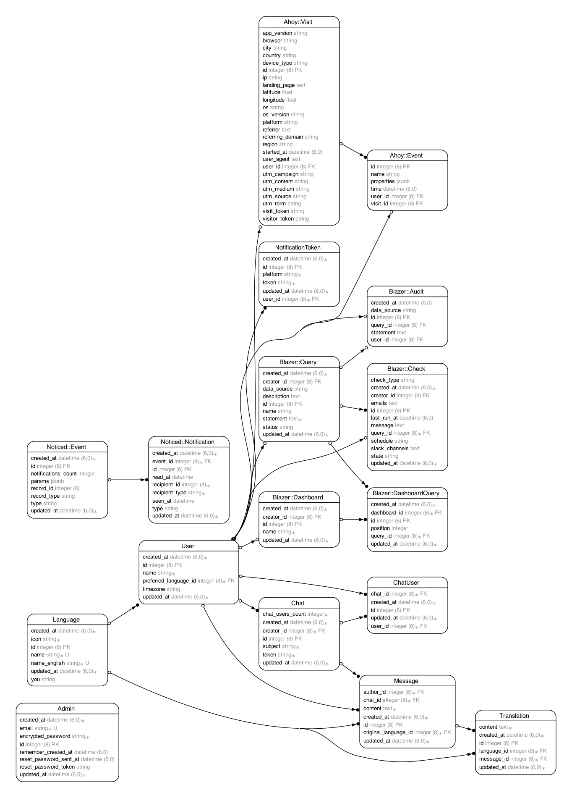

# Shinar

A multilingual chat application that allows users to communicate across language barriers.

## Setup

1. Clone the repository
2. Run the setup script:
   ```
   bin/setup
   ```

This will install all dependencies, set up the database with seed and sample data, and prepare your development environment.

## Development

### Running the Server

Use Foreman to run the development server which will start the Rails server, JavaScript bundling, and CSS processing in parallel:

```
bin/dev
```

This will start:
- Rails server on http://localhost:3000
- JS build process with esbuild (watching for changes)
- CSS build process with Sass (watching for changes)

### Bundling

This application uses:
- `jsbundling-rails` with esbuild for JavaScript
- `cssbundling-rails` with Sass for CSS
- Bootstrap 5 for UI components

## ERD


